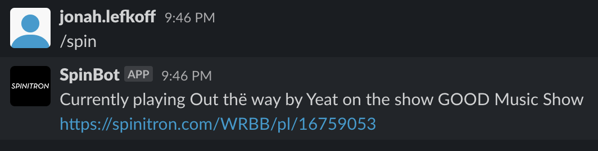

# Jonah-WRBB-SlackBot

Final Project for EECE2140. A slack bot for WRBB

# Final Report:

### Summary

WRBB is Northeastern's campus radio station. We broadcast 24/7 with music played by student DJs. WRBB uses slack to communicate internally. In our community slack, we have a channel called #on-air-rn for DJs to comment on the music currently being played. Something that bugged me about this was you never knew what the song was unless the person posting explicitly said it. I decided to write a bot that helps with this issue. Whenever a user wants, they can call the bot by typing `\spin` into the slack message prompt. This then returns the current song, artist, show title, and a link to the full playlist. This allows all of the DJs an easy way to get this information without having to leave slack. 

This code is run as a flask webserver on a cloud VPS. When a user inputs the `/spin` command, it redirects that request as a POST request to a url endpoint as defined by the flask code in `slackbot.py`. The request is returned as a JSON payload with the formatted text for slack to post. By using slash commands, we can avoid requiring an event listener that is always listening to a specific slack channel for commands. This reduces technical overhead and creates a simpler interface.

### Overview of the code

Running a flask webserver continuously requires the webserver gateway interface, or WSGI. This allows the python flask server to live behind the real host application called nginx. The flask app runs as a service on ubuntu, and the WSGI application creates a UNIX socket for the endpoints to be forwarded by nginx. I followed [this guide](https://www.digitalocean.com/community/tutorials/how-to-serve-flask-applications-with-uwsgi-and-nginx-on-ubuntu-22-04) for setting up the WSGI+Flask instance. This is required as slash commands need a public facing endpoint to address POST requests to.

The files `wsgi.py` and `slackbot.ini` are not included in this github repo as they contain information specific to the system they are installed on. These files are exact copies of those found in the tutorial above.

Obtaining the correct credentials for a slack app is easy, simply visit api.slack.com and create a new app. Following [this tutorial](https://api.slack.com/interactivity/slash-commands), slash commands become simple to implement. 

In order for the app to function properly, you must create a `.env` file in the main directory. This file must include two tokens, `SPINITRON_TOKEN` and `VERIFICATION_TOKEN` (slack). The slack token can be found as the "Bot User OAuth Token" on the Oauth tab of the slack api portal. The spinitron token is specifically for spinitron radio stations, and cannot be easily obtained.

Once all of this has been done, the slack app should function perfectly! A screenshot of proper operation is shown below.

The slackbot.py file serves as the flask server and only contains the spin endpoint and authentication code. The spinitron_fetch.py file gets the json payload containing the current song and more, and returns these details in a formatted string.

#### Suggested future directions

Two things this project could use are:

1. Automagically embedding the associated spotify link into the message content. This is unfortunately not in the spinitron json response, so another api would have to be used.
2. Adding reaction buttons to allow users to reqeuest songs further back in time than the current song.

# Assignment 1: Project Proposal

1. *Who is on your team? If you are working with a partner, how will the labor be divided?*

I am the sole member of my team.

2. *An overview of the project similar in scope and length to the example projects listed below.*

The project is a slack bot for WRBB, our campus radio station. It will interface with Spinitron.com, our music logging servie. Users will be able to have the bot return information about the currently playing song. You will be able to request either the current song or the past 3. These will be translated to spotify urls for slack integration. The user may also request information on the currently playing DJ's name, real name, show title, show description, and episode information. This will also lead to a link to the current show playlist.

3. *A short description of the structure of your project. How many classes will you write? What the methods be for each class? (You can change this if it turns out a better structure would work better once you start writing code and you decide to refactor. Just try to come up with a reasonable one for the proposal.)*

There will be a class to make requests to the spinitron API. Additionally, there will be two classes dealing with the slack API, one to listen for the commands and one to write messages in response. Finally, there will be one class to convert the spinitron data into a format that slack can understand (likely a spotify url).

4. *What libraries and tools will you need to learn to use?*

- Requests for the spinitron API
- Slack API python library

5. Identify the highest-priority features, the medium-priority features, and the lowest-priority features for your project.

High priority:

- Interface with Slack API
- Interface with Spinitron API
- Return the current song

Medium priority:

- Return the past 3 songs

Low Priority:

- Return the current DJ's name, real name, show title, show description, and episode information
